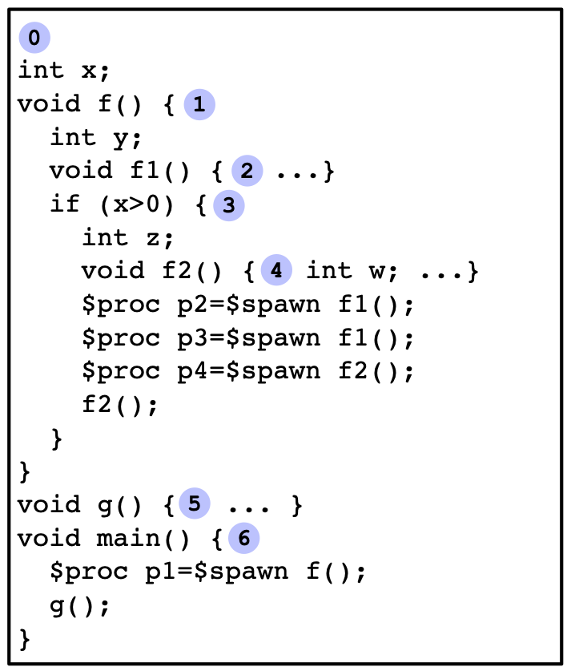
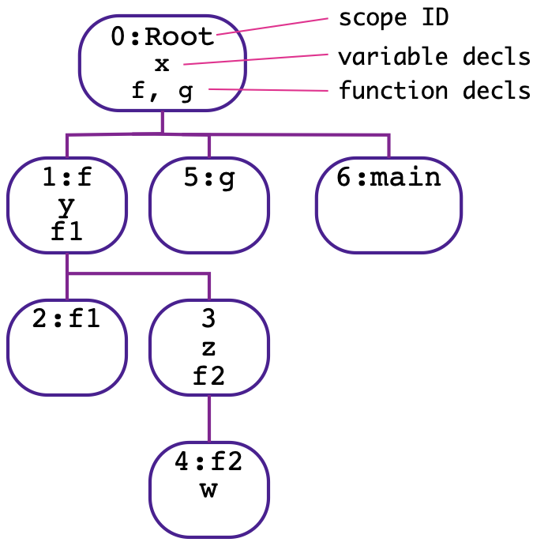
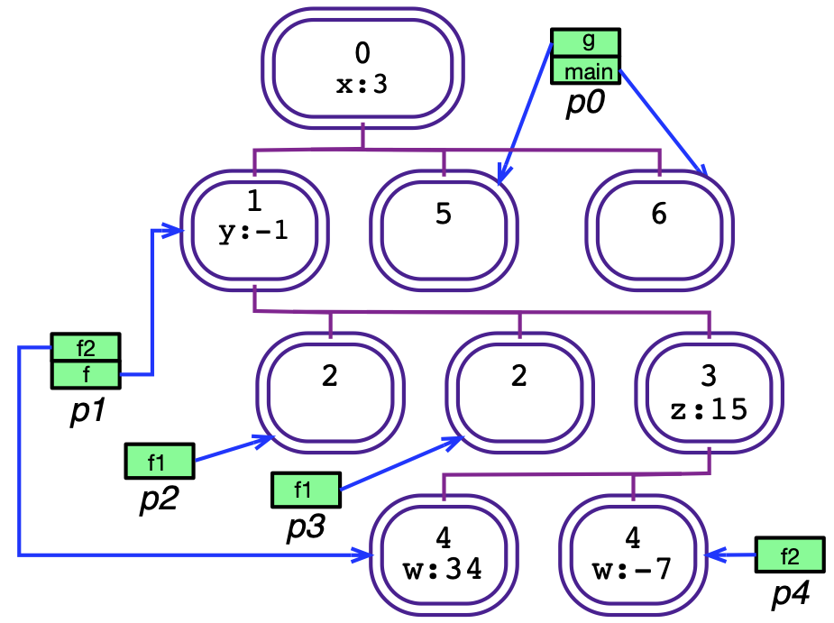

# CIVL-C Fundamentals

## Overview of CIVL-C

### Main Concepts

CIVL-C is an extension of a subset of Standard C. It includes the most commonly-used elements of C, including most of the syntax, types, expressions, and statements. Missing are some of the more esoteric type qualifiers, bitwise operations (at least for now), and much of the standard library. Moreover, none of the C language elements dealing with concurrency are included, as CIVL-C has its own concurrency primitives.

The keywords in CIVL-C not already in C begin with the symbol `$`. This makes them readily identifiable and also prevents any naming conflicts with identifiers in C programs. This means that most legal C programs will also be legal CIVL-C programs.

One of the most important features of CIVL-C not found in standard C is the ability to define functions in any scope. (Standard C allows function definitions only in the file scope.) This feature is also found in GNU C, the GNU extension of C.

Another central CIVL-C feature is the ability to spawn functions, i.e., run the function in a new process (thread).

Scopes and processes are the two central themes of CIVL-C. Each has a static and a dynamic aspect. The static scopes correspond to the lexical scopes in the program—typically, regions de- limited by curly braces `{`. . . `}`. At runtime, these scopes are instantiated when control in a process reaches the beginning of the scope. Processes are created dynamically by spawning functions; hence the functions are the static representation of processes.

### Example Illustrating Scopes and Processes

To understand the static and dynamic nature of scopes and processes, and the relations between them, we consider the (artificial) example code in Fig. 1(a). The static scopes in the code are numbered from 0 to 6.

| (a) Code skeleton                | (b) Static scope tree           | (c) Dynamic scopes and call stacks |
|----------------------------------|---------------------------------|------------------------------------|
|  |  |   |
/// caption
**Figure 1.** CIVL-C scopes. (a) Code skeleton to illustrate scope hierarchy.
(b) Static scope tree. (c) State showing dynamic scopes and process call stacks.
///

The static scopes have a tree structure: one scope is a child of another if the first is immediately contained in the second. Scope 0, which is the file scope (or root scope) is the root of this tree. The static scope tree is depicted in Fig. 1(b). Each scope is identified by its integer ID. Additionally, if the scope happens to be the scope of a function definition, the name of the function is included in this identifier. A node in this tree also shows the variables and functions declared in the scope. For brevity, we omit the proc variables.

We now look at what happens when this program executes. Fig. 1(c) illustrates a possible state of the program at one point in an execution. We now explain how this state is arrived at.

First, there is an implicit root function placed around the entire code. The body of the main function becomes the body of the root function, and the main function itself disappears. This minor transformation does not change the structure of the scope tree.

Execution begins by spawning a process p0 to execute the root function. This causes scope 0 to be instantiated. An instance of a static scope is known as a *dynamic scope*, or *dyscopes* for short. The dynamic scopes are represented by the ovals with double borders in Fig. 1(c). Each dyscope specifies a value for every variable declared in the corresponding static scope. In this case, the value 3 has been assigned to variable x.

The state of process p0 is represented by a call stack (green). The entries on this stack are activation frames. Each frame contains two data: a reference to a dyscope (indicated by blue arrows) and a current location (or programmer counter value) in the static scope corresponding to that dyscope (not shown). The dyscope defines the environment in which the process evaluates expressions and executes statements. The currently executing function of a process, corresponding to the top frame in the call stack, can “see” only the variables in its dyscope and those of all the ancestors of its dyscope in the dyscope tree.
Returning to the example, p0 enters scope 6, instantiating that scope, and then spawns procedure `f`. This creates process p1, with a new stack with a frame pointing to a dyscope corresponding to static scope 1. The new process proceeds to run concurrently with p0. Meanwhile, p0 calls procedure `g`, which pushes a new entry onto its call stack, and instantiates scope 5. Hence p0 has two entries on its stack: the bottom one pointing to the instance of scope 6, the top one pointing to the instance of scope 5.

Meanwhile, assume x > 0, so that p1 takes the true branch of the if statement, instantiating scope 3 under the instance of scope 1. It then spawns two copies of procedure `f1`, creating processes p2 and p3 and two instances of scope 2. Then p1 spawns `f2`, creating process p4 and an instance of scope 4. Note that the instance of scope 4 is a child of the instance of scope 3, since the (static) scope 4 is a child of scope 3. Finally, p1 calls `f2`, pushing a new entry on its stack and creating another instance of scope 4. The final state arrived at is the one shown.

There are few key points to understand:

* In any state, there is a mapping from the dyscope tree to the static scope tree which maps a dyscope to the static scope of which it is an instance. This mapping is a tree homomorphism, i.e., if dyscope u is a child of dyscope v, then the static scope corresponding to u is a child of the static scope corresponding to v.
* A static scope may have any number of instances, including 0.
* Dynamic scopes are created when control enters the corresponding static scope; they disappear from the state when they become unreachable. A dyscope v is “reachable” if some process has a frame pointing to a dyscope u and there is a path from u up to v that follows the parent edges in the dyscope tree.
* Processes are created when functions are spawned; they disappear from the state when their stack becomes empty (either because the process terminates normally or invokes the exit system function).

### Structure of a CIVL-C program

A CIVL-C program is structured very much like a standard C program. In particular, a CIVL- C program may use the preprocessor directives specified in the C Standard, and with the same meaning. A source program is preprocessed, then parsed, resulting in a translation unit, just as with standard C. The main differences are the nesting of function definitions and the new primitives beginning with `$`, which are described in detail in the remainder of this part of the manual.

If the suffix of the filename of the program is not `.cvl`, then the program must include the line
```c
#include <civlc.cvh>
```
somewhere near the beginning (before any CIVL-C primitives are used).  This includes the main CIVL-C header file, which declares all the types and other CIVL primitives.

As usual, a translation unit consists of a sequence of variable declarations, function prototypes, and function definitions in file scope. In addition, assume statements may occur in the file scope.  These are used to state assumptions on the input values to a program.
